# Hello-MicroBlaze
## Demonstration of Hello World Program by Implementation of MicroBlaze Processor on FPGA
---

___This is my first repository in github, so any suggestions and feedbacks are welcomed ! 
For connecting with me for future projects, you can connect with [me](https://www.linkedin.com/in/aswinsilicon/)___


---
This project has only one motive. It is to experiment with MicroBlaze processor, and thereby try to create a serial connection between the computer and the MicroBlaze Processor using UART communication. This first project is a primary resource for me to practice, with the open source toolchain and definitely to keep a documentation that is easily understandable by anyone who later tries to practice it the same way. I will keep on updating this repository whenever it is required.

Let's Start

---

### NOTE: This repository follows Linux based Operating System. I have used [Ubuntu 24.04.1 LTS](https://ubuntu.com/download/desktop).
#### Make sure all the libraries that are necessary for all these below software are installed in your system. Also this would cost a lot of space as well so I suggest to get atleast 250GB of storage and atleast 8GB RAM.
---
## Contents
- [1. Ubuntu Setup](#1-Ubuntu-Setup)
- [2. Necessary Libraries Installation](#2-Necessary-Libraries-Installation)
- [3. Xilinx Unified Software Setup](#3-Xilinx-Unified-Software-Setup)
- [4. Visual Studio Code Setup](#4-Visual-Studio-Code-Setup)
  - [4.1. Install Serial Monitor](#41-Install-Serial-Monitor)
- [5. MicroBlaze- An Introduction](#5-MicroBlaze-An-Introduction)
- [6. Project Procedure](#6-Project-Procedure)
- [7. Results](#7-Results)

## 1. Ubuntu Setup
### I would strongly suggest to Dual Boot your system rather than only keeping Ubuntu 24.04.1 LTS on your system.
  - You can follow the procedure shown in this [video](https://www.youtube.com/watch?v=XjQGGLa_Dic).
  - Make sure you have a minimum 16GB Pendrive available with you.

## 2. Necessary Libraries Installation
- Run the following commands one by one after proper installation of Ubuntu 24.04.1 LTS
```
$ sudo apt update
$ sudo apt upgrade-y
$ sudo apt install build-essential
$ sudo apt install libtinfo-dev
$ sudo apt-get install libtinfo5
$ sudo apt install libncurses5
$ sudo ln -s /lib/x86_64-linux-gnu/libtinfo.so.6 /lib/x86_64-linux-gnu/libtinfo.so.5
$ sudo apt-get install putty
```

## 3. Xilinx Unified Software Setup
### I have used 2023.2 version of the Xilinx Unified Software.
### NOTE: Before going for the installation, make sure all the libraries mentioned above (Section 2) are installed properly on your system, else there is a chance that the installer may get hang at the final processing part.
  - You can download the Linux Self Extracting Web Installer from this [site](https://www.xilinx.com/support/download/index.html/content/xilinx/en/downloadNav/vitis/2023-2.html)
  - I would suggest installing the Vitis Core Development Kit - 2023.2, which is under the section Vitis (SW Developer) tab.
  - Once downloaded, note down the name of the installed 'bin' file name. You will need to remember this in order to open the installer through the Ubuntu Terminal.
  - In my case, it is 'FPGAs_AdaptiveSoCs_Unified_2023.2_1013_2256_Lin64.bin'.
  - Now, open the Ubuntu Terminal and type the following commands to open Linux Self Extracting Web Installer by Xilinx.
```
$ cd $HOME/Downloads
$ chmod u+x FPGAs_AdaptiveSoCs_Unified_2023.2_1013_2256_Lin64.bin
$ sudo ./FPGAs_AdaptiveSoCs_Unified_2023.2_1013_2256_Lin64.bin
```
- ### Note that you need to replace the file name according to your version in order to open the installer.
 - Login with your credentials.
 - Select Vitis among the different options.
 - Click on next.
 - Choose the installation directory where you want to store the files. I would suggest to store in '/tools/Xilinx'.
 - Install.
 - Once installation is complete, we must ensure all our necessary softwares are properly loading. To check, proceed with the following commands on the Ubuntu Terminal:
 - ### Vivado-
   ```
   $ /tools/Xilinx/Vivado/2023.2/bin/vivado
   ```
   - The Vivado home page should look like this.
    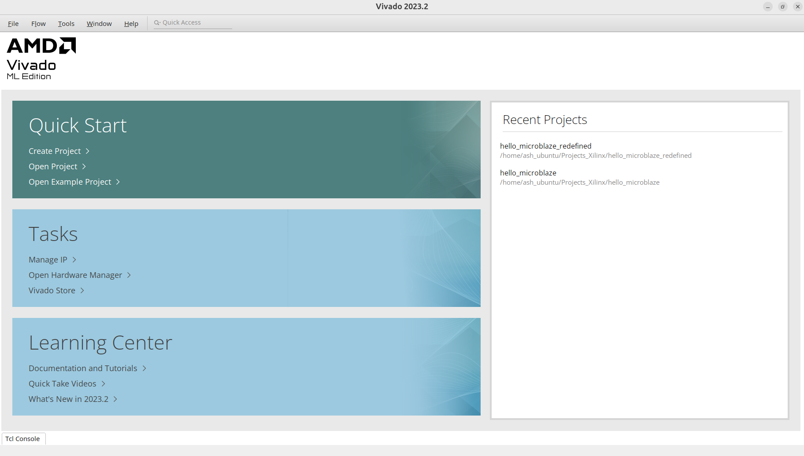
- ### Vitis Unified Software-
   ```
   $ /tools/Xilinx/Vitis/2023.2/bin/vitis
   ```
   - The Uninfied IDE home page should look like this.
   - 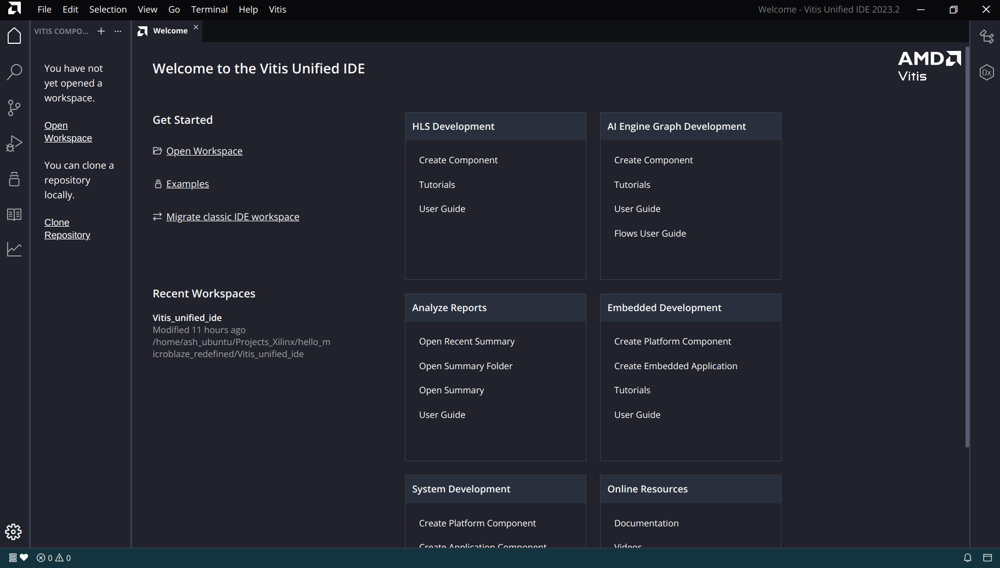
- ### Installing the Development Board Definition in the Vitis Software
  #### I will be using Digilent Basys 3 FPGA Board
 - the github link from where to download the master.zip [file](https://github.com/Digilent/vivado-boards/archive/master.zip)
 - Extract the zip file
 - go to /vivado-boards-master/new/board_files and copy basys3 folder
 - paste the folder to /tools/Xilinx/Vivado/2023.2/data/boards/board_files directory (create a boards_files folder if missing and then paste it)
     
## 4. Visual Studio Code Setup
- I would suggest you the download the Visual Studio Code by referring to this [video](https://www.youtube.com/watch?v=vLm2EHIaxOo)
- Replace apt, Install GDEBI.
- Using GDEBI Package Installer it is easier to open Visual Studio Code.
- Now download '.deb package (64-bit) ' from this [site](https://code.visualstudio.com/docs/setup/linux#_install-vs-code-on-linux)
- Once it gets downloaded, open the package using GDEBI Package Installer.
- Now you may see the Visual Studio Code icon on the Ubuntu 'Show Tabs' section.
- Open it to verify whether it loads well.
  - The Visual Studio Code home page should look like this.
  - 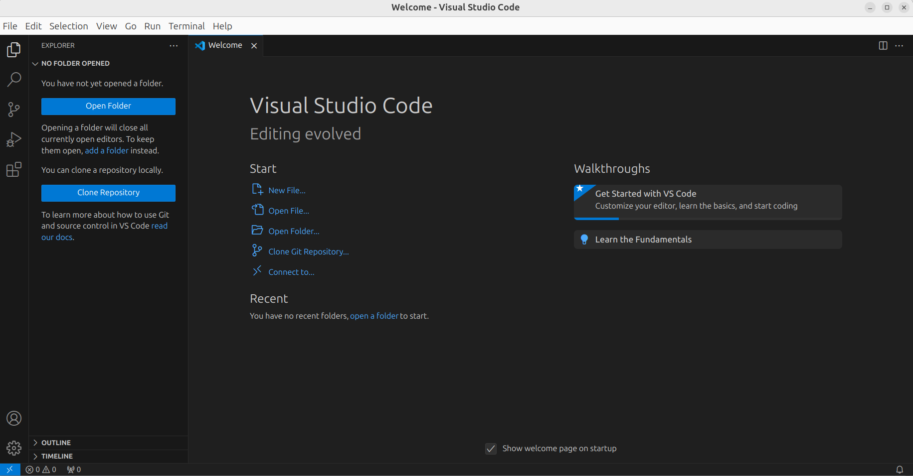
  
### 4.1 Install Serial Monitor
- Click on Extensions.
- Search for Serial Monitor 
- Make sure that the publisher is Microsoft Corporation.
  - It should be like this.
- Click on install.
- To make sure the proper installation, use key board shortcut 'Ctrl+Shift+P' to open search bar, type serial monitor.
- Click on the option- 'View: Toggle Serial Monitor'


## 5. MicroBlaze- An Introduction
- The AMD MicroBlaze processor offers a range of customizable, easy-to-integrate, 32-bit/64-bit microprocessor configurations based on the efficient RISC Harvard architecture.
- MicroBlaze processor offers flexibility, allowing for a wide range of customizations with peripheral, memory, and interface features.
- It has found its way into many applications over the years across multiple areas, including industrial, medical, automotive, consumer, and communication markets.
- Developers can target the MicroBlaze processor to any AMD adaptive SoC or FPGA device supported by the Vivado Design Suite.
  
  
### 5.1 Key Capabilities
  
#### 5.1.1 Three Different Configurations
- Microcontroller: Ideal for executing bare-metal code​
- Real-time processor: Ensures deterministic real-time processing on an Real-Time Operating System
- Application processor: Capable of running on embedded Linux​
#### 5.1.2 Advanced Features
- Offers customization with over 70 user configuration options and a catalog of driver-enabled, drag-and-drop peripherals such as Ethernet subsystems, UARTs, USB 2.0, and streaming FIFOs​
- Incorporates advanced features, including a 32-bit instruction set, multi-purpose registers, and an expandable address bus up to 64 bits​
- Offers safety in critical applications with dual-core lockstep and triple modular redundancy (TMR) capabilities, alongside an optional floating-point unit and power management modes, including sleep, hibernate, and suspend operations​
#### 5.1.3 High Degree of Design Flexibility
- Offers a fully integrated design flow in the Vivado and Vitis™ tools​
- Compatible with any AMD adaptive SoC or FPGA supported in the Vivado or IDS design tools​
- Three-stage pipeline for optimal footprint and 5-stage pipeline for maximum performance

## 6. Project Procedure
- Open Vivado using the following command in the Ubuntu Terminal:
   ```
   $ /tools/Xilinx/Vivado/2023.2/bin/vivado
   ```
   ### 6.1 (Vivado)
   - In the Quick Start Tab, click on Create Project.
     
   - Give a project name of your choice and specify a directory
     
   - Under default part section click on Boards and search for Basys3.
     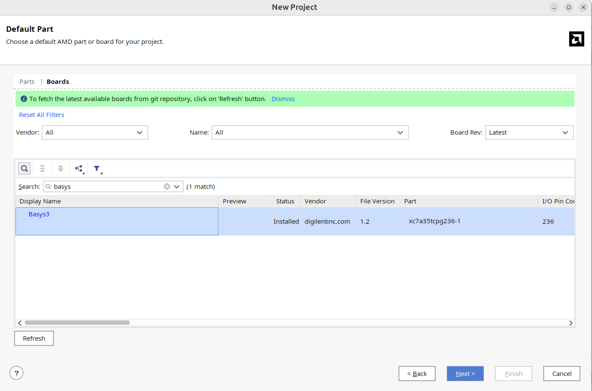
     - #### NOTE: If you could not find, you can also select xc7a35tcpg236-1 part under the Parts section. But I would strongly suggest to download Basys3 Definition Board File (___refer to Section 3 of this readme file___)
   - Click on next until we reach the project dashboard.
     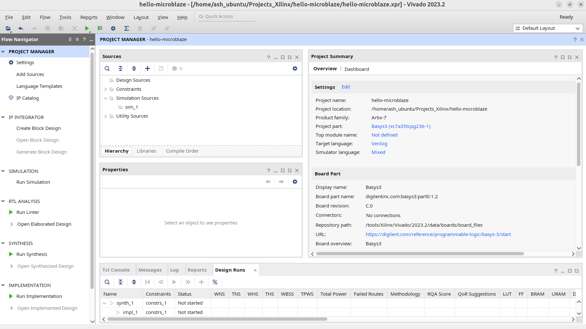
   - In the Project Manager tab, under the IP INTEGRATOR section, click on Create Block Design.
     - A block design provides a visual representation of your hardware design, and can be used to easily connect and configure IP cores.
   - Now, the interface should like this:
     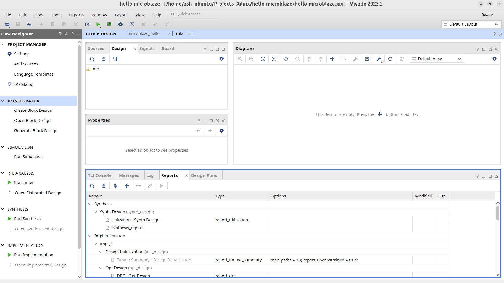
   - Click on + (To add a new IP- An IP block in Vivado is a reusable unit of logic that can be used to create complex system designs)
     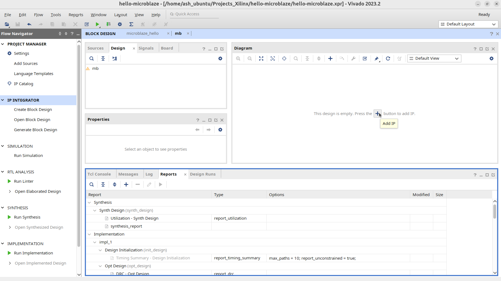
   - Search for Microblaze and select it.
   - It should look like this
     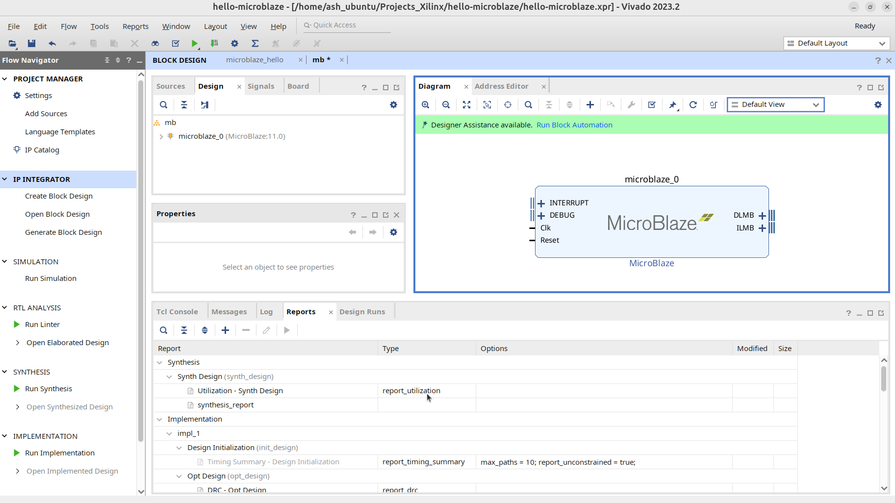
   - Click on Run Block Automation.
   - In the pop up window, under the local memory option, you may change it to 128KB to allocate more on-chip Block RAM (BRAM).
   - Click on OK.
   - Again, click on + (to add a new IP).
   - Similarly, Search for AXI Uartlite and select it.(it is a soft core interface that allows for asynchronous serial data transfer. It connects to the Advanced Microcontroller Bus Architecture specification's Advanced eXtensible Interface)
     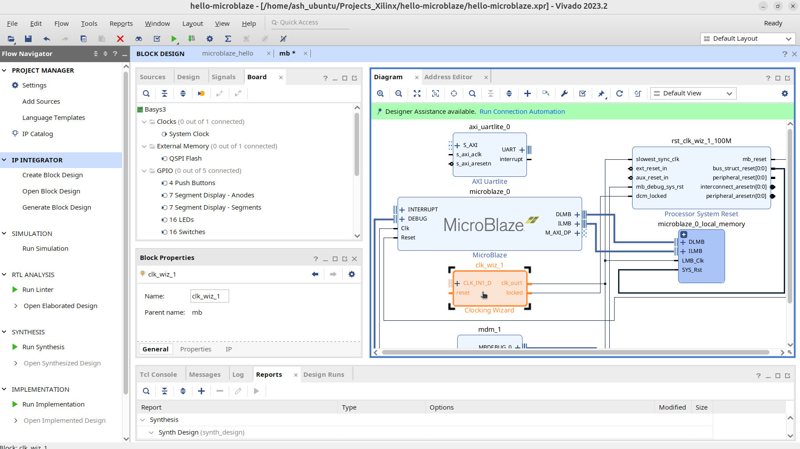
   - Now click on Clocking Wizard as shown in the figure, and change the CLK_IN to sys clock and EXTERNAL RESET_IN to reset.
     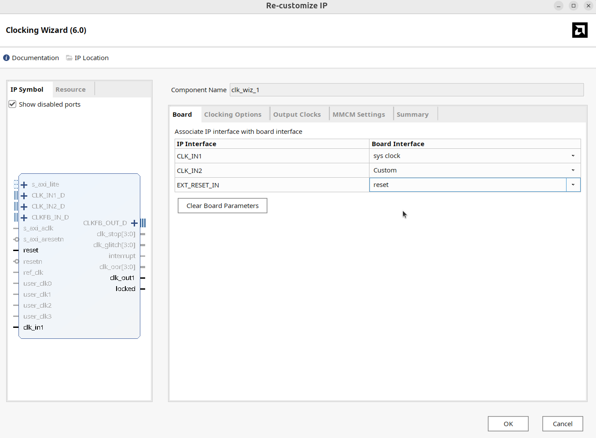
   - Click on Run Connection Automation, check all the boxes and click OK.
     
   - Now click on regenerate layout, to make the design more simplistic and easy to understand.
     
   - Click on F6 to validate design.
   - Click on Address Editor section and just have a look at the Master Base Address, Master High Address and Range:
     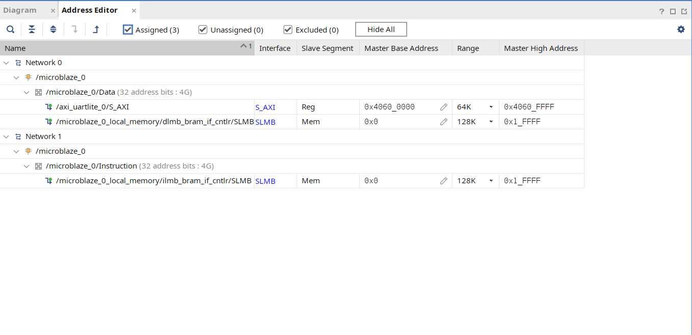
   - Now click on Run Synthesis option, under Project Manager tab.
   - Once the Synthesis Completed tab pops up, click on Open Synthesized design.
     - The package should look similar to this:
       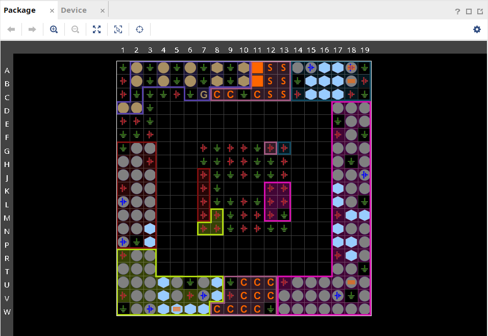
     - The device containing LUTs and Flip-FLops should look like this:
       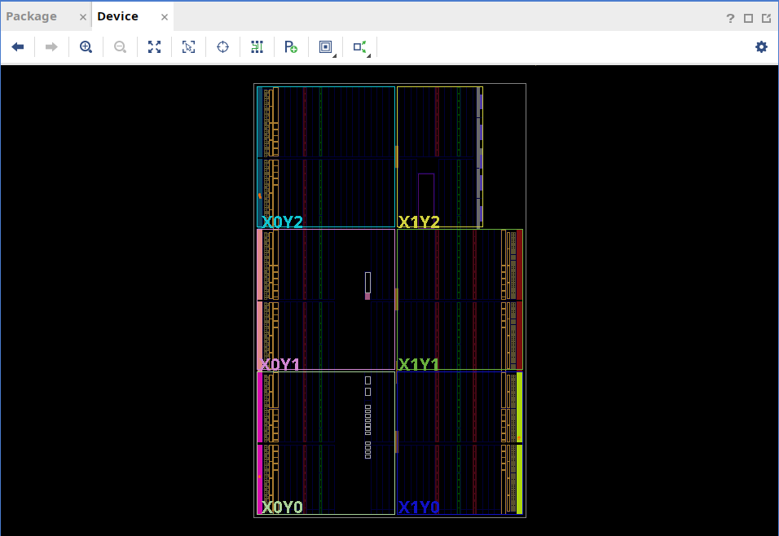
   - Scroll down in the Project Manager tab and click on Generate Bitstream.
   - Once bitstream is generated, click on File tab, click on Export> Export Hardware> Next> Include Bitstream> Create a XSA file 
   - After Exporting Hardware, click on Tools section, click on Launch Vitis IDE.
   ### 6.2 (Vitis IDE)
   - We will enter the Vitis IDE home interface.
   - Under Embedded Developement, click on Create Platform Component.
   - Enter your desired name, click on next, under the Select Platform Flow, click on Hardware Design, browse and select for the wrapper file/ XSA file we have created:
     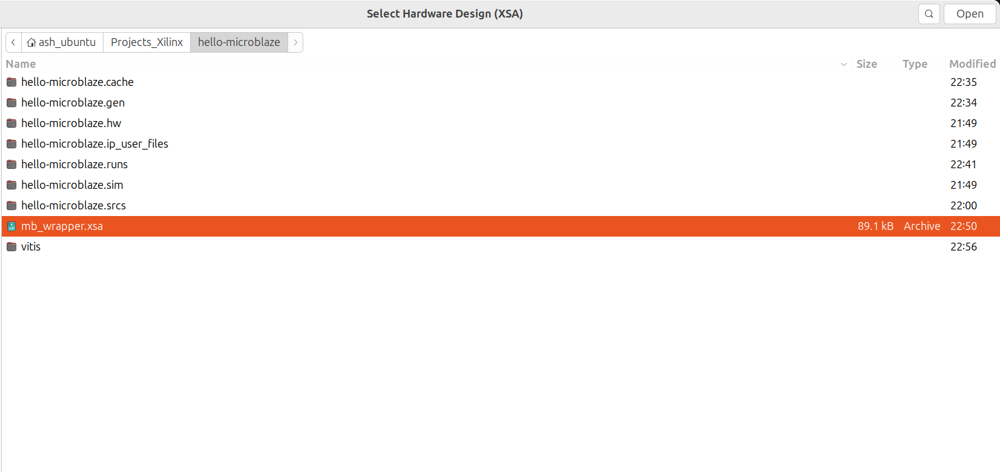
   - After that, click on next, and finish.
   - Now, under View tab, click on Examples option, select Hello World. Select the previously created platform flow and click on next.
   - Click on Build under Flow tab.
   - Once the BUild is complete, click on Vitis tab and click on Target Connections, select Local, and click on OK.
   - Now, click on Program Device.
   - Click on Run.
   ### 6.3 (Visual Studio Code)
   - Open Visual Studio Code on your system.
   - use key board shortcut 'Ctrl+Shift+P' to open search bar, type serial monitor.
   - Click on the option- 'View: Toggle Serial Monitor'
   - Parallely open Putty SSH Client which we had installed earlier:
      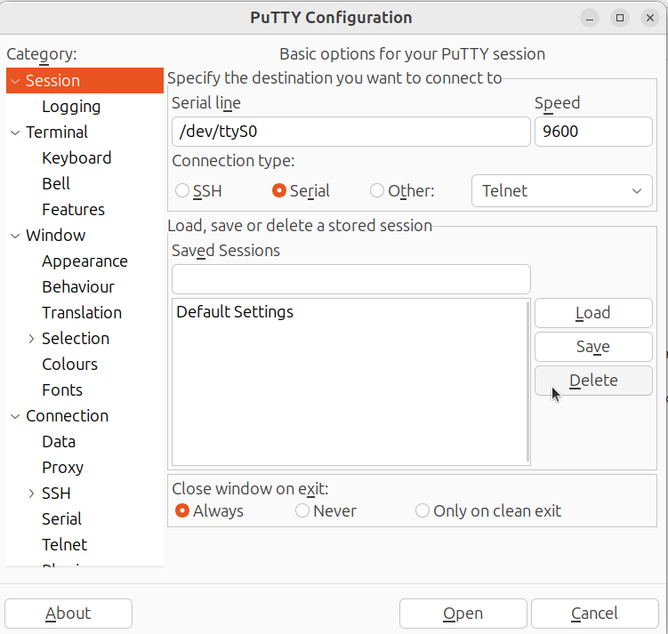
      - Click on Serial> instead on dev/tty/S0, write dev/tty/USB0 and click on Open. (This USB0 is nothing but the USB Port on your system where FPGA Board is connected).
   - Come back to Visual Studio Code, click on Ports, select dev/tty/USB0, and finally click on Start Monitoring option.
   - Press the reset button on your FPGA and note the output on the serial monitor.
   ## The output should be like this:
   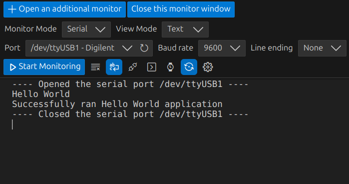


